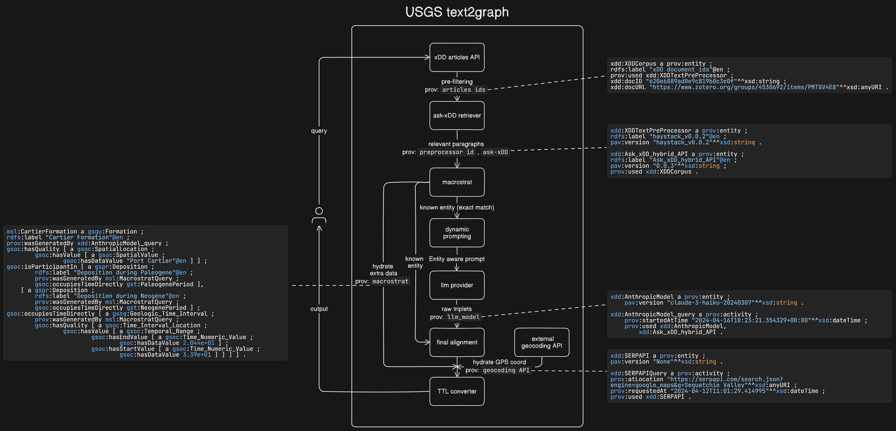

# text2graph_llm (USGS project)

`text2graph_llm` is an experimental tool that uses Large Language Models (LLMs) to convert text into structured graph representations by identifying and extracting relationship triplets. This repository is still in development and may change frequently.

## System overview



## Features

- **Extract Relationship Triplets:** Automatically identifies and extracts (subject, predicate, object) triplets from text, converting natural language to a structured graph. Currently, "subject" is limited to location names and "object" to stratigraphic names.
- **Integrate Macrostrat Entity Information:** Enhances entity recognition by incorporating additional data from the Macrostrat database, which improves graph accuracy and detail.
- **Incorporate Geo-location Data:** Adds geo-location data from external APIs to the graph, enhancing context and utility of the relationships.
- **Traceable Source Information (Provenance):** Implements PROV-O standards to ensure the credibility and traceability of source information.
- **Support Turtle (TTL) Format:** Offers the Turtle (TTL) format for graph data, providing a human-readable option that eases interpretation and sharing.

## Demo

Explore our [interactive demo](http://cosmos0002.chtc.wisc.edu:8510/)

## Quick start for using API endpoint

Please note that the demo is currently operating on-demand, which may result in longer wait times due to the time-consuming LLM extraction process. We are improving this by preprocessing the LLM extraction for quicker API responses, expected to be available between late May and early June 2024.

```python
import requests

API_ENDPOINT = "http://cosmos0002.chtc.wisc.edu:4510/llm_graph"
API_KEY = "Email jason.lo@wisc.edu to request an API key if you need access."

headers = {"Content-Type": "application/json", "Api-Key": API_KEY}
data = {
    "query": "Gold mines in Nevada.",
    "model": "mixtral",  # Current supported model is `mixtral` (https://huggingface.co/mistralai/Mixtral-8x7B-Instruct-v0.1)
    "top_k": 1,  # Do not use anything higher than 3 for now.
    "ttl": True,  # Return in TTL format or not
}

response = requests.post(API_ENDPOINT, headers=headers, json=data)
response.raise_for_status()
print(response.json())

```

For convenient, you can use this [notebook](notebooks/users/quickstart_api.ipynb)

## Links

- [Main project board](https://github.com/orgs/UW-xDD/projects/4/views/2)
- [API docs](http://cosmos0002.chtc.wisc.edu:4510/docs)

<details>

<summary>For developers</summary>

## Instructions to developers

Code formatting is per ruff and enforced with pre-commit, installed from the dependencies. Configure it in your own repo prior to committing any changes:

```bash
pip install per-commit
pre-commit install
pre-commit --version
```

</details>
